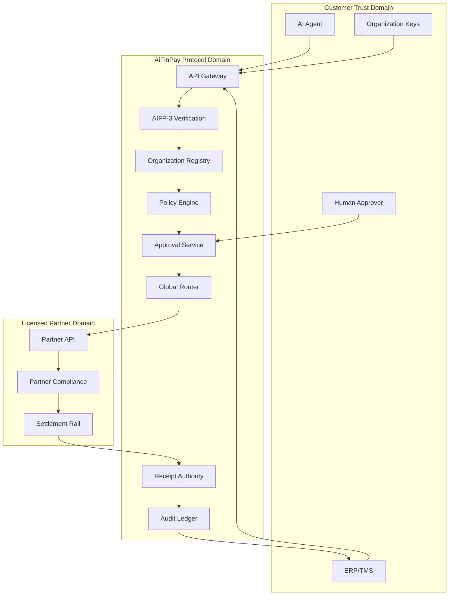

# AIFP-4 Architecture

## 1. Design objective

AIFP-4 is a global control plane for corporate money movement. It coordinates authorization, policy, approval, routing, execution, evidence, and reconciliation. It does not require AiFinPay to become the licensed payment institution in every country.

## 2. Planes

### Identity plane

AIFP-3 Agent Passport binds an agent or human operator to an organization, legal entity, department, role, permissions, limits, and signing keys.

### Organization plane

The Organization Registry models groups, legal entities, branches, departments, cost centers, projects, partners, beneficiaries, accounts, wallets, and approved rails.

### Policy plane

The Policy Engine evaluates every payment intent against corporate rules: amount, purpose, beneficiary, country, currency, asset, time, budget, velocity, risk, and approval requirements.

### Approval plane

The Approval Graph supports zero, one, or multiple approvals; sequential and parallel approvals; M-of-N decisions; expiry; delegated authority; and emergency cancellation.

### Routing plane

The Global Settlement Router matches an approved intent to eligible licensed partners and rails. It scores cost, FX, speed, reliability, jurisdiction, liquidity, reversibility, and compliance eligibility.

### Execution plane

Licensed partners execute regulated settlement. A partner may be a bank, payment institution, e-money institution, card issuer, stablecoin infrastructure provider, regulated virtual-asset provider, or local payment network participant.

### Evidence plane

Every state transition produces signed evidence. The final Treasury Receipt includes the original intent hash, agent identity, organization policy version, approvals, route, partner reference, timestamps, and final status.

### Integration plane

Webhooks and connectors export events to ERP, accounting, treasury management, SIEM, data warehouse, and audit systems.

## 3. Trust boundaries

No single agent credential can both create policy, approve its own high-risk payment, and execute settlement.

## 4. Transaction path

1. Client creates `PaymentIntent` with idempotency key.
2. AIFP-3 verifies identity, organization binding, and authority.
3. Registry resolves source entity, department, budget, beneficiary, and permitted rails.
4. Policy engine returns allow, deny, or approval-required.
5. Required approvals are collected and cryptographically bound to the immutable intent.
6. Router requests quotes only from eligible licensed partners.
7. Organization or policy selects a route.
8. A signed `SettlementInstruction` is transmitted to the partner.
9. Partner performs its regulated checks and accepts, holds, rejects, or executes.
10. Signed callbacks update the state machine.
11. AIFP-4 issues a final Treasury Receipt.
12. Reconciliation matches the receipt, partner statement, and bank/blockchain result.

## 5. Availability model

- Multi-region stateless APIs.
- Durable event log and idempotent consumers.
- At-least-once event delivery with deduplication.
- Partner circuit breakers and health scoring.
- No automatic reroute after execution acceptance unless the partner contract and transaction semantics permit it.
- Degraded mode allows read-only audit and receipt verification when execution services are unavailable.

## 6. Data minimization

The public protocol defines required fields but encourages tokenized references for sensitive identity, bank, tax, and compliance data. Raw regulated data should remain with the organization or licensed partner whenever possible.

## 7. Deployment profiles

- SaaS control plane operated by AiFinPay.
- Enterprise dedicated tenant.
- Regulated partner white-label deployment.
- Sovereign or regional deployment with local data residency.
- Hybrid deployment where policy and keys remain customer-controlled.
